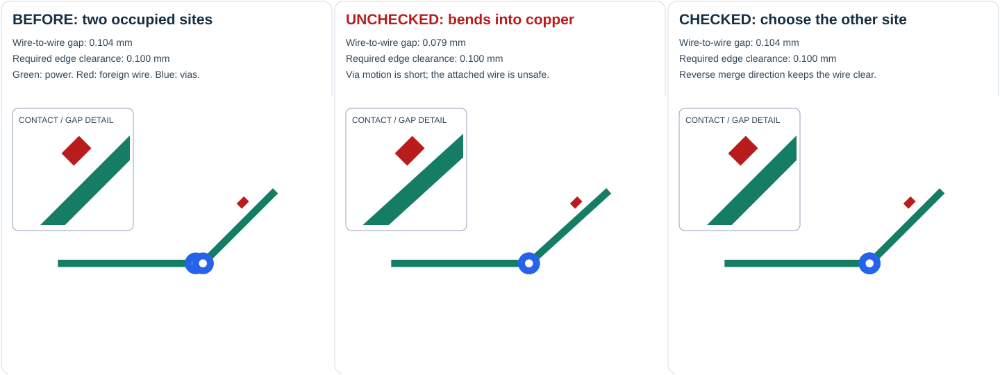
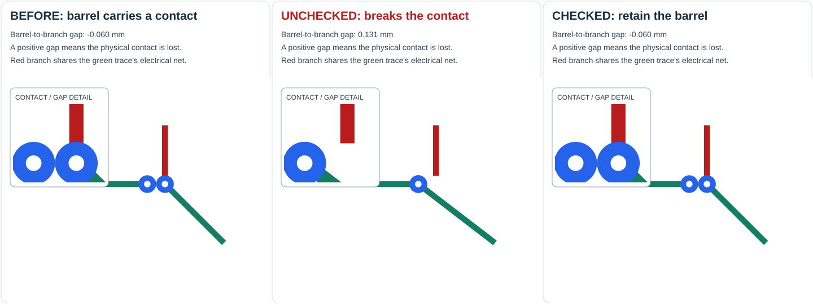
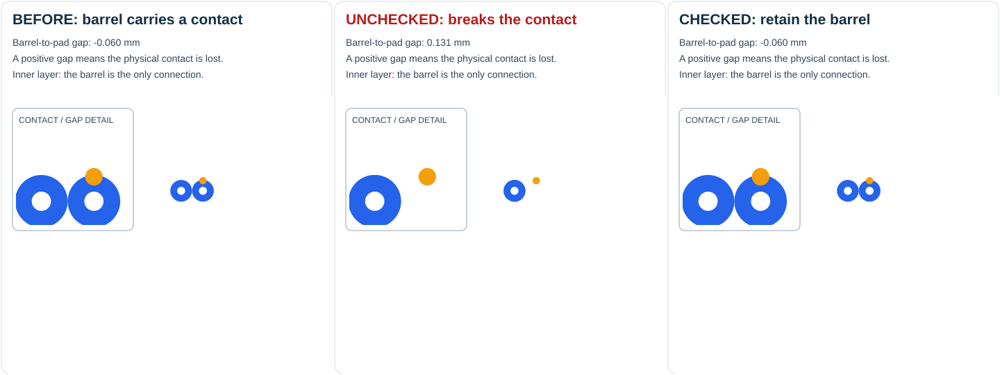

# Clearance-preserving via merging: review guide

[Watch the 80-second walkthrough](via-merge-review/walkthrough.mp4). It has burned-in captions, needs no audio, and is rendered from the same solved fixtures as the visual tests.

| Time | Example | What the test proves |
| --- | --- | --- |
| 0:07 | Attached wire | The unchecked merge reduces a 0.104 mm gap to 0.079 mm; choosing the other occupied site preserves the required 0.100 mm gap. |
| 0:28 | Same-net branch | Removing a barrel creates a 0.131 mm separation from its branch. Logical net membership does not preserve physical contact. |
| 0:49 | Inner-layer pad | A barrel can be a pad's only contact on a layer with no attached wire. That merge must remain rejected. |
| 1:10 | Candidate flow | Generate geometry, validate it, then let the caller decide whether to publish it. |

The unchecked panels run the existing topology simplification mode, which expects later routing stages to repair intermediate copper. The checked panels enable the clearance constraints needed by a late DRC repair caller. These are solver outputs, not manually drawn candidate routes.

## Inspect the geometry

Each snapshot has the same viewport in all three panels and a magnified detail. Wire widths and via radii represent copper dimensions. Blue circles are via copper; white centers mark drill sites. The branch example's red wire is on the **same net** as the green wires. In the wire example, red is a **foreign net**. Orange marks the inner-layer pad.







## Follow the implementation

1. `SameNetViaMergerSolver` enumerates occupied same-net targets using its existing neighborhood search. Each proposal removes one physical source site, including every mutable route sharing it. Equal diameters prevent adding via copper at the destination. Endpoint and terminal anchors stay fixed.
2. The existing move operation builds the proposed routes. `isViaMergeCandidateValid` examines that completed geometry once: changed wires must clear foreign copper and the outline, and affected same-net wire/pad contacts must survive. It checks removed barrels on every board layer. Jumper routes remain outside this repair mode.
3. `getClearancePreservingMergeCandidates()` yields valid proposals without committing them. A rejected proposal does not alter the current routes or suppress another occupied target. `solve()` commits one valid proposal per step and refreshes its collision index.

There is no validation callback. A caller needing whole-board DRC iterates proposals, checks `candidate.routes`, and keeps the accepted routes outside the merger. After accepting a proposal, it constructs a fresh merger from that geometry before looking for the next improvement. Autorouter PR [#2730](https://github.com/tscircuit/tscircuit-autorouter/pull/2730) requires a strict reduction in its reference DRC count, which bounds those rounds.

The geometric checks are intentionally conservative: every affected physical contact must survive. They do not attempt a global electrical-connectivity reroute or introduce a new via location.

## Test map

| Behavior | Focused test |
| --- | --- |
| Measured before / unchecked / checked wire clearance | [wire visual](../tests/solvers/same-net-via-merger-wire-visual.test.ts) |
| Measured branch and inner-layer pad continuity | [branch visual](../tests/solvers/same-net-via-merger-branch-visual.test.ts), [pad visual](../tests/solvers/same-net-via-merger-pad-visual.test.ts) |
| Contact causes rejection; removing that pad permits the merge | [pad contact](../tests/solvers/same-net-via-merger-preserves-pad-contact.test.ts) |
| Foreign copper dimensions and layers | [foreign via](../tests/solvers/same-net-via-merger-foreign-via-clearance.test.ts), [variable width](../tests/solvers/same-net-via-merger-variable-width-clearance.test.ts), [circle pad](../tests/solvers/same-net-via-merger-circle-pad-clearance.test.ts), [rotated pad](../tests/solvers/same-net-via-merger-rotated-pad-clearance.test.ts), [layers](../tests/solvers/same-net-via-merger-layer-clearance.test.ts) |
| Wire width plus board-edge margin, including endpoints on the outline | [board edge](../tests/solvers/same-net-via-merger-board-edge-clearance.test.ts) |
| Physical site ownership and independent source proposals | [shared source](../tests/solvers/same-net-via-merger-shared-source-site.test.ts), [independent sources](../tests/solvers/same-net-via-merger-independent-source-sites.test.ts) |
| No mutation when a caller rejects a proposal; another target remains available | [candidate acceptance](../tests/solvers/same-net-via-merger-candidate-acceptance.test.ts) |
| Collision index refresh and later proposals retaining accepted geometry | [successive groups](../tests/solvers/same-net-via-merger-successive-groups.test.ts) |
| Equal via diameters, anchored terminals, and valid units | [diameters](../tests/solvers/same-net-via-merger-equal-diameter.test.ts), [terminal](../tests/solvers/same-net-via-merger-port-anchor.test.ts), [margins](../tests/solvers/same-net-via-merger-clearance-margins.test.ts) |

## Reproduce

```sh
bun install
bun run test
bun run typecheck
bun run format:check
# Requires ffmpeg on PATH; FFMPEG_PATH can select an installed binary.
bun scripts/render-via-merge-review.ts
```

The video generator executes the shared fixtures, renders frames with `graphics-debug` and Resvg, and encodes them with ffmpeg. Temporary frames go under `tmp/via-merge-review-frames`; the resulting MP4 goes under `docs/via-merge-review`. The video does not claim a full-board benchmark result from these minimal examples.
